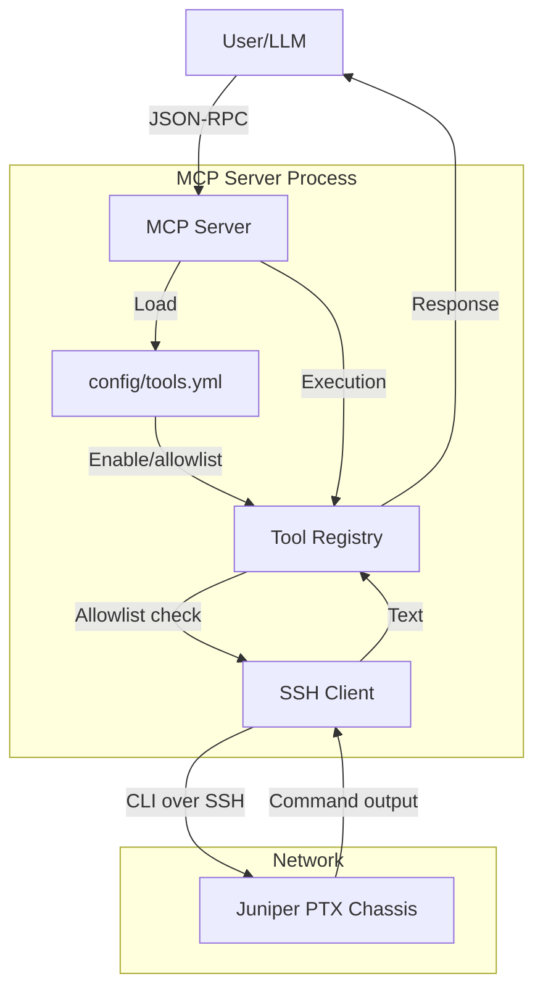

# Software Architecture

High-level architecture and data flow. All device interaction is over **SSH** (no NETCONF/RPC).

## Component Diagram

## Data Flow

1. **Initialization**: Server loads `config/tools.yml` (allowed_tools, `allowed_ssh_commands` regex). Only listed tools are registered.
2. **Request**: User/LLM sends a tool call (e.g. `run_cli` with command `show version`).
3. **Allowlist**: Command is checked against `allowed_ssh_commands`; if it does not match any pattern, the request is rejected.
4. **Device**: SSH client runs the command on the PTX and returns the raw output.
5. **Response**: Server returns the output to the client.

## Technology Stack

- **Language**: Python 3.11+
- **Protocol**: Model Context Protocol (MCP)
- **Device**: SSH (paramiko); CLI only
- **Configuration**: YAML (`config/tools.yml`)
- **Deployment**: Docker
